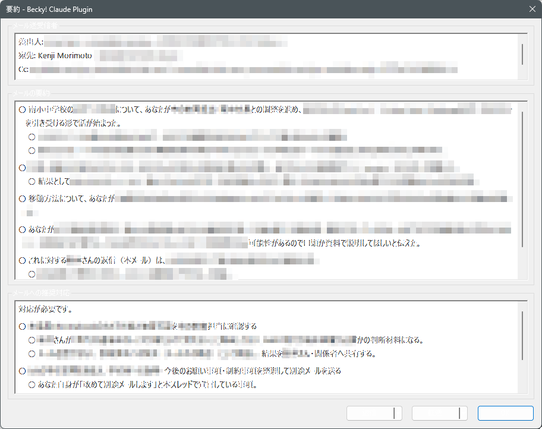
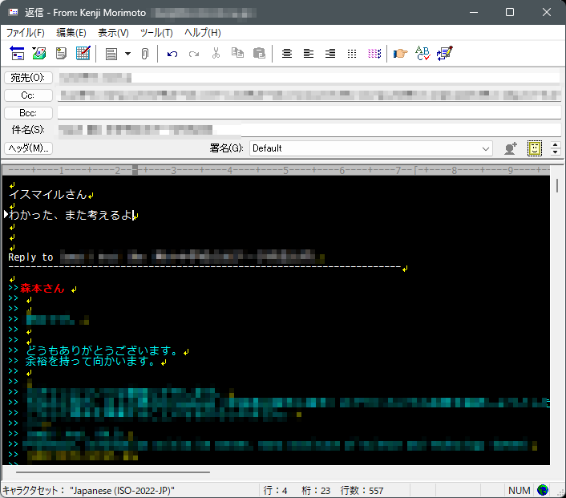
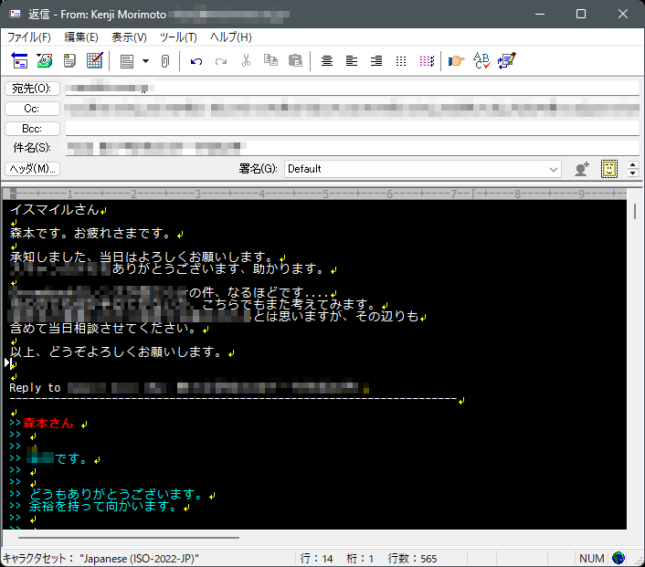
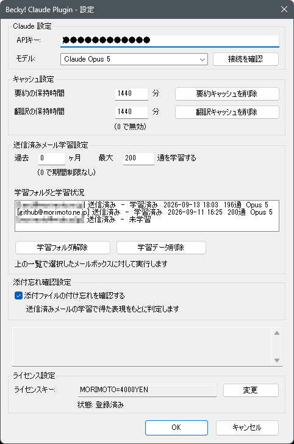

# Becky! Claude Plugin

*A plug-in for Becky! Internet Mail that brings Anthropic's Claude into the mail client: summarise and translate incoming mail, draft replies in your own writing style, proofread what you wrote, and warn you before sending a mail that mentions an attachment you forgot. Japanese-first; the user guide is [BkClaude.txt](BkClaude.txt).*

Becky! Internet Mail に Claude との連携機能を組み込むプラグインです。

- **受信メール** — 要約（誰から・要点・推奨対応の3欄）、日本語への翻訳
- **作成中のメール** — 返信の下書き、校正（差分表示つき）、英語への翻訳
- **送信時** — 本文で添付に触れているのに添付がないメールを送る前に確認
- **文体の学習** — 送信済みメールから、あなたの書き方を学習して下書きに反映

すべて右クリックメニューと「ツール」メニューから呼び出せます。

詳しい使い方、設定、保存されるデータは **[BkClaude.txt](BkClaude.txt)** をご覧ください。

## 画面

*要約 — 送受信者・要約・推奨対応の3欄に整理されます*

| 下書き前 | 下書き後 |
|---|---|
|  |  |

*引用の上に書いたメモ（左）が、学習した文体の本文になります（右）*

*設定画面*

## 必ずお読みください

処理対象のメール本文は Anthropic の API に送信されます。利用には Anthropic の API キーが必要で、API 利用料はご自身の負担です。詳細は BkClaude.txt の 1 章にあります。

## インストール

1. [Releases](../../releases) から zip をダウンロードして展開します。
2. Becky! を終了し、`BkClaude.dll` と `BkClaude.txt` を Becky! の `PlugIns` フォルダに置きます（例: `C:\Program Files (x86)\RimArts\B2\PlugIns\`）。
3. Becky! を起動し、「ツール」→「プラグインの設定」→「Becky! Claude Plugin」で API キーを設定します。

動作環境: Becky! ver.2（32ビット）、Windows 10/11。追加ランタイムは不要です。

## ライセンス

[MIT License](LICENSE)。同梱の nlohmann/json も MIT です（[THIRD-PARTY-NOTICES.txt](THIRD-PARTY-NOTICES.txt)）。

本プラグインはシェアウェアですが、開発途中で価格が未定のため、当面はライセンスキーを公開しています。

    ライセンスキー: MORIMOTO=4000YEN

価格の確定時に改めてご案内します。
